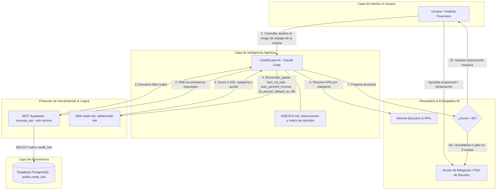

# Diagrama de Flujo del Sistema Agéntico: Credit Risk & Default Intelligence

```mermaid
graph TD
    %% Roles y Capas
    subgraph CAPA_INTERFAZ [Capa de Interfaz & Usuario]
        UI[Usuario / Analista Financiero]
    end

    subgraph CAPA_ORQUESTACION [Capa de Inteligencia Agéntica]
        AGENT[CreditGuard AI - Claude Code]
        PROMPT[AGENTS.md: instrucciones y matriz de decisión]
        AGENT --- PROMPT
    end

    subgraph CAPA_HERRAMIENTAS [Protocolo de Herramientas & Logica]
        DATA[MCP Supabase: execute_sql - solo lectura]
        SKILL[Skill credit-risk: skills/credit-risk]
    end

    subgraph CAPA_DATOS [Capa de Persistencia]
        DB[(Supabase PostgreSQL: public.credit_risk)]
    end

    subgraph CAPA_SALIDA [Resultados & Entregables BI]
        OUT_DASHBOARD[Informe Ejecutivo & KPIs]
        OUT_ACTION[Acción de Mitigación / Plan de Recobro]
        HUMAN{¿Score > 65?}
    end

    %% Flujo de Ejecución Secuencial
    UI -->|1. Consulta: analiza el riesgo de impago de la cartera| AGENT

    AGENT -->|2. Pide los préstamos expuestos| DATA
    DATA -->|SELECT sobre credit_risk| DB
    DATA -->|3. Devuelve filas reales| AGENT

    AGENT -->|4. Envía loan_grade, loan_int_rate, loan_percent_income, cb_person_default_on_file| SKILL
    SKILL -->|5. Score 0-100, categoría y acción| AGENT

    AGENT -->|6. Resume KPIs por categoría| OUT_DASHBOARD
    AGENT -->|7. Propone acciones| HUMAN
    HUMAN -->|No: recordatorio o plan en 3 cuotas| OUT_ACTION
    HUMAN -->|Sí: requiere autorización humana| UI
    UI -->|Aprueba suspensión / reclamación| OUT_ACTION
```
